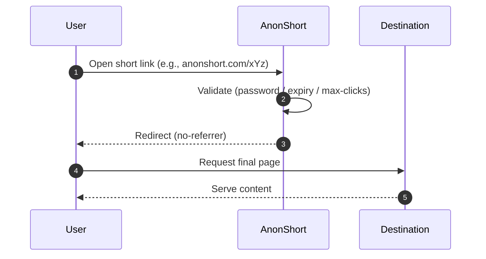

<!--
  AnonShort — README
  Notes:
  - Replace /assets/banner.png and /assets/preview.gif with your actual images (or remove those blocks).
  - Keep links up to date in the header.
  - This README focuses on clarity and developer experience without SEO keyword stuffing.
-->

<div align="center">

  <!-- Optional: project banner -->
  <a href="https://anonshort.com">
    
  </a>

  <h1>AnonShort</h1>
  <p><strong>Anonymous • Secure • Fast</strong></p>

  <p>
    <a href="https://anonshort.com"><strong>Website</strong></a> ·
    <a href="https://anonshort.com/api"><strong>API Docs</strong></a> ·
    <a href="https://t.me/AnonShortBot">Telegram Bot</a> ·
    <a href="https://t.me/+E2QR7t6ahJUyMzVl">Telegram Channel</a>
  </p>

  <p>
    
    
    
    
  </p>

</div>

---

## Table of Contents
- [Overview](#overview)
- [Features](#features)
- [Live Services](#live-services)
- [Quick Start](#quick-start)
- [API Quick Reference](#api-quick-reference)
  - [Create Short Link](#create-short-link)
  - [Optional Controls](#optional-controls)
  - [Response Example](#response-example)
  - [Client Examples](#client-examples)
- [Privacy & Security](#privacy--security)
- [Preview](#preview)
- [How It Works](#how-it-works)
- [FAQ](#faq)
- [Contact](#contact)
- [License](#license)

---

## Overview

**AnonShort** is a privacy-focused URL shortener for people who want anonymous, secure, and fast link sharing.  
No logs. No tracking. No ads. Just clean redirects and a simple interface.

---

## Features

- Custom short paths  
- Password-protected links  
- Time-based expiry  
- One-time access links  
- Self-destruct links (max-clicks)  
- Private stats page  
- Anonymous (no-referrer) redirects  
- Built-in QR Code generator  
- Unlimited public API  
- Clean, fast, ad‑free interface

---

## Live Services

- 🌐 **Website:** https://anonshort.com  
- 📚 **API Docs:** https://anonshort.com/api  
- 🤖 **Telegram Bot:** https://t.me/AnonShortBot  
- 📣 **Telegram Channel:** https://t.me/+E2QR7t6ahJUyMzVl

---

## Quick Start

### Use the Website
1. Go to **https://anonshort.com**
2. Paste your long URL
3. (Optional) Set a password, custom path, expiry, max-clicks, or no-referrer
4. Create and share your short link

### Use the Telegram Bot
- Chat with **[@AnonShortBot](https://t.me/AnonShortBot)**  
- Send a URL (and optional parameters); the bot returns the short link and QR

---

## API Quick Reference

> For the complete specification and any updates, see **https://anonshort.com/api**.  
> Endpoint names and parameters below are representative; adjust if your API differs.

### Create Short Link

`POST https://anonshort.com/api/shorten`

**Request body (JSON)**
```json
{
  "url": "https://example.com",
  "custom": "my-link",
  "password": "optional",
  "expire_in": "1d",
  "max_clicks": 1,
  "no_referrer": true
}
```

**cURL**
```bash
curl -X POST https://anonshort.com/api/shorten   -H "Content-Type: application/json"   -d '{
    "url": "https://example.com",
    "custom": "my-link",
    "password": "optional",
    "expire_in": "1d",
    "max_clicks": 1,
    "no_referrer": true
  }'
```

### Optional Controls
- **custom**: custom slug/path for the short URL  
- **password**: require a password before redirect  
- **expire_in**: time-to-live (e.g., `10m`, `1h`, `1d`, `7d`)  
- **max_clicks**: destroy the link after N visits  
- **no_referrer**: remove referrer when redirecting

### Response Example
```json
{
  "ok": true,
  "short_url": "https://anonshort.com/my-link",
  "id": "my-link",
  "qr_url": "https://anonshort.com/api/qr/my-link",
  "expires_at": "2025-12-31T23:59:59Z",
  "max_clicks": 1
}
```

### Client Examples

**JavaScript (fetch)**
```js
async function shorten(url) {
  const res = await fetch('https://anonshort.com/api/shorten', {
    method: 'POST',
    headers: { 'Content-Type': 'application/json' },
    body: JSON.stringify({
      url,
      custom: 'my-link',
      password: 'optional',
      expire_in: '1d',
      max_clicks: 1,
      no_referrer: true
    })
  });

  if (!res.ok) throw new Error(\`HTTP \${res.status}\`);
  return res.json();
}

shorten('https://example.com').then(console.log).catch(console.error);
```

**Python (requests)**
```python
import requests

payload = {
    "url": "https://example.com",
    "custom": "my-link",
    "password": "optional",
    "expire_in": "1d",
    "max_clicks": 1,
    "no_referrer": True
}

r = requests.post("https://anonshort.com/api/shorten", json=payload, timeout=30)
r.raise_for_status()
print(r.json())
```

---

## Privacy & Security

- **No logs:** identifying access logs are not retained.  
- **No tracking:** no ads or third‑party trackers.  
- **No cookies:** public pages do not use tracking cookies.  
- **No‑referrer:** hide the referrer on redirects when enabled.  
- **HTTPS‑only:** encrypted in transit.

> **Tip:** Do not share the password in the same place where you share the short link.

---

## Preview

> Replace the placeholder image with an actual screenshot or GIF.

<p align="center">
  
</p>

---

## How It Works



---

## FAQ

**Is the stats page public?**  
No. Stats are private.

**What happens after max-clicks is reached?**  
The link self-destructs and no longer redirects.

**Can I use custom slugs?**  
Yes — set the `custom` field when creating the link.

**Do you support QR codes?**  
Yes — a QR is generated for each short link.

---

## Contact

- Website: **https://anonshort.com**  
- Telegram Bot: **https://t.me/AnonShortBot**  
- Telegram Channel: **https://t.me/+E2QR7t6ahJUyMzVl**  
- Email: **anonshort@protonmail.com**

<p align="center">
  
</p>

---

## License

© 2025 AnonShort — Protecting your privacy.
